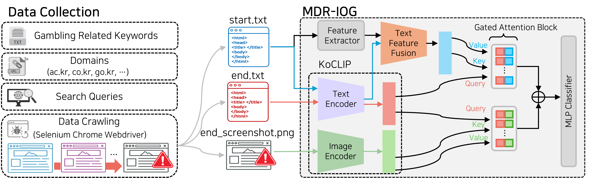
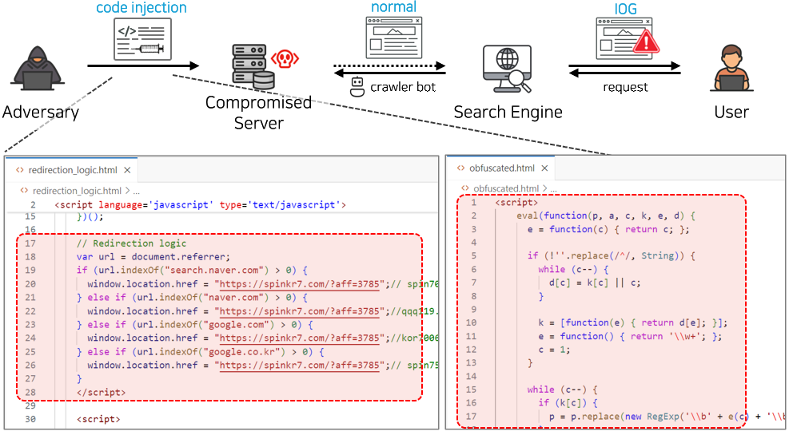

# TriModal

In this project, we propose a multimodal framework, `TriModal`, that detects websites leading to illegal gambling websites using three modalities.

- We utilize `KoCLIP`, a Korean specialized CLIP variant, to project text and image embedding into the same semantic space.
- We design and apply Gated Attention Block to effectively integrate input modalities.

### Framework Overview

- This is the overview of our framework, `TriModal`. We effectively integrate HTML text and features from the initial web page (`start.txt`) and the landing page (`end.txt`), and finally a screenshot of the final landing page (`end_screenshot.png`).
- We collect 123 keywords and 14 domains, resulting 12,054 search queries.
- We perform data crawling using the Google Selenium Chrome Webdriver.
- Then we embed the data using `KoCLIP` (https://github.com/jaketae/koclip/tree/master). We also extract features related to redirection from the resource collected from the initial web page.
- We perform `Gated Attention Fusion` using two `Gated Attention Block`.
- Final predicion is obtained through the final MLP layers.

### Redirection Overview

- This figure illustrates the overview of process of an redirection process.
- An adversary intrudes an web server infrastructure and injects malicious code or scripts that initiate redirection.
- Various SEO manipulation campaigns or redirection execution is performed at this stage.
- A crawler from a search engine crawls content from the compromised server. However, benign web content is rendered and therefore it is brough to the user.
- However, upon user interaction, the malicious code redirects the web user to their illegal online gambling site.


# Structure
```
REDIRECTION/
├── data/
├── pt_data/
│ ├── koclip_pt_start/
│ ├── koclip_pt_end/
│ ├── koclip_pt_image/
├── logs/
├── checkpoints/
├── utils/
│ ├── dataset.py
│ ├── metrics.py
│ ├── models.py
│ ├── tokenize_end.py
│ ├── tokenize_img.py
│ ├── tokenize_start.py
├── README.md
├── requirements.txt
├── main.py
├── run_all.sh
├── test_all.sh
```


# Get Started
1. Create an virtual environment with Python 3.13 and install the required packages in `requirements.txt`.
```
pip install -r requirements.txt
```
2. Place your dataset in the `/data` folder.
3. Pre-embed the collected data using the following executions.
```
python utils/tokenize_end.py
python utils/tokenize_img.py
python utils/tokenize_start.py
```
4. Next, train the model by executing the code included in the `run_all.sh` file.
```
./run_all.sh
```
- The results will be saved in the `/logs` file.
- The best models will be saved in the `/checkpoints` folder.
5. After training, only evaluation can be performed by executing the code in the `test_all.sh` file.
```
./test_all.sh
```

# Results
## 1. Detection Results
We evaluate our model on $D_{full}$ and $D_{reduced}$ using six metrics (Precision, Recall, F1-Score, Accuracy, False Positive Rate (FPR), and False Negative Rate (FNR)).

- Our proposed architecture efficiently integrates all of the given input (S E I) and performs the best achieving an F1-Score 98.11% and 97.24% for both datasets with very low FPR and FNR.
- Using image as input soley performs the second best.

Details of the dataset is presented here.


## 2. Training Details
Here, we present the training and inference details on $D_{reduced}$.


- The test set comprises 2,836 samples. Therefore, the inference time required per sample is very low (4.94 seconds / 2,836 $\approx$ 0.0017 seconds).
- Embedding time also takes less than one second for all modalities.
    - start.txt: 0.82 seconds
    - end.txt: 0.80 seconds
    - end_screenshot.png: 0.46 seconds
- Therefore, assuming that data embedding is processed in parallel, after data collection from web crawlers, classification can be performed in less than one seconds, while achieving an accuracy greater than 98% with FPR $<$ 0% in detection of IOG sites.

<!-- # Data Collection
## 1. Selenium Chrome Webdriver -->


<!-- # Data Refinement
## 1. Imagedup
We use `Imagedup` (https://github.com/idealo/imagededup) to cluster similar or duplicate images. We further refine our dataset by labeling the clustered groups manually. 

## 2. Dataset Details
The details of the curated dataset is presented. We collected 14,174 redirection samples.

 -->
